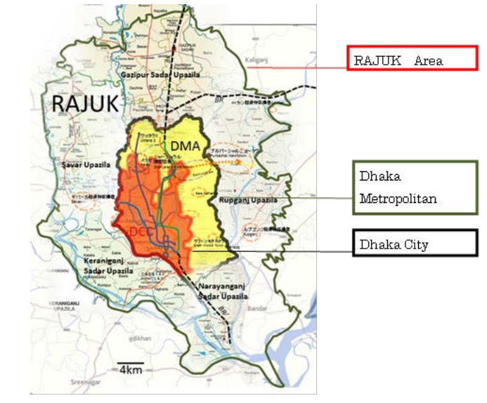
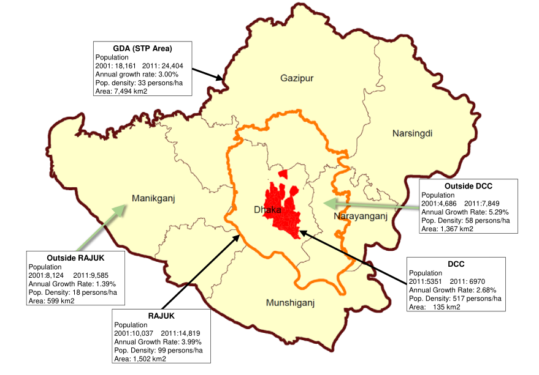
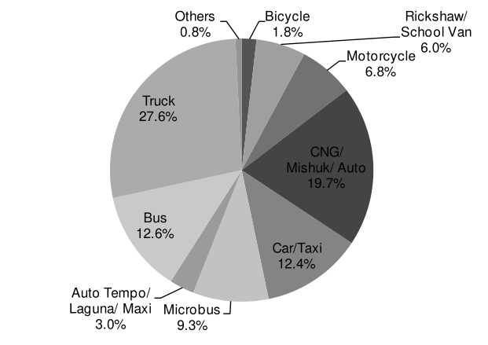
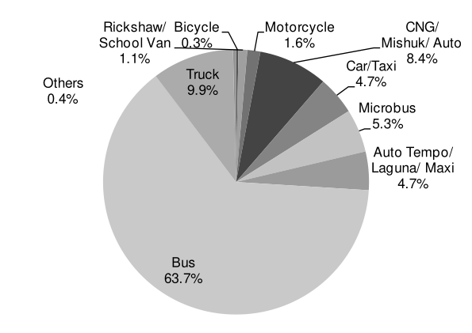
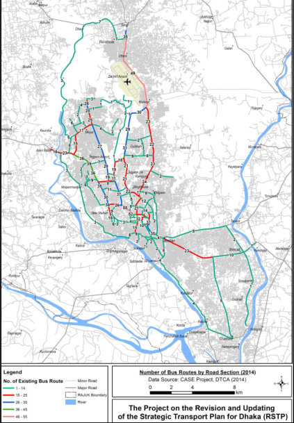

```{r setup, echo = FALSE }
library(knitr)
opts_chunk$set(echo=FALSE, comment=NA, warning=FALSE, message=FALSE)
source("../work_flow/RFILES/fig_serial_ref.R")
source("../work_flow/RFILES/tab_serial_ref.R")
```

# Introduction 

It was a sultry summer afternoon on 29th July of 2018. Two students of Shaheed Ramiz Uddin Cantonment School and College, Abdul Karim and Dia Khanom Mim, was waiting on the roadside of Airport road in Kurmitola area. Then according to eye witness, an Uttara-bound bus of 'Jabal-e-Noor Paribahan' lost control and ran over those two hapless students. They were dead on the spot.

This tragic event instigated a  unique movement  in the streets of Dhaka, Bangladesh. It brought about protests throughout the country and particularly in Dhaka, the school students took over the control of the streets replacing the traffic police. It created a great political upheaval in Bangladesh.  High school kids, secondary school kids came to streets protesting death of two of their friends.  This kids actually ruled the city for a few days, controlling traffics. This protests finally ended after a week or so amidst government crackdown which allegedly through human rights abuse. But it captured a big part of public imagination and is believed to remain in public memory for a long time.

It was a common incident that Bus drivers are quite reckless. That was not the first time it happened. Frequently these city buses were involved in several accidents. People were already pissed off. Therefore, when kids got involved it became very sensitive.

With this background, we would like to investigate whether mass transportation, particularly Bus service is problematic or not. It is apparent this sector is quite competitive. There are quite a few actors in the market. Bus drivers compete with each other to pick up passengers and finish the trip earlier.

It is usually expected that competition will bring about better service and quality in a market. In transportation sector in Bangladesh it seemed that competition brought about the worst possible outcome for transportation. This paper investigates the reasons behind this phenomenon. We found that this is actually a classic case of market failure since mass transportation is essentially a public good with externality effect. Therefore, market equilibrium resulted into socially inefficient outcome. A related  objective of this paper is to look into the economic incentive of Bus operators that lead to this stiff aggressively competitive behaviors which led to the tragic incident. We will look into the current employment structure which is actually determined by the whole mass transportation industry.


# Transporation infrastructre


First start with an small intro of dhaka. then talk about the population size, how fast it is growing. then talk about modal share and show the importance of bus.

Dhaka is one of the megacities in the world. Currently its rank is this. It has population of 14.8 million. The area of Dhaka can be defined in various ways.

from page 23 of @dtca_rstp_2015

```{r, fig.height=2.5}

```

from page  of @dtca_rstp_2015

```{r, fig.width=2.5}

```

Mini-bus is a shorter version bus which can not carry more than 30 passengers. If it can carry more than 30 passengers then it is a bus. 


The population in the above area  growing very fast. To meet the daily needs of this high population, at present, there are about 30 million trips produced per day in Dhaka.  The transportation of this huge population is dependent on bus. Let's have a look at the following figures.

from @dtca_rstp_2015

```{r, fig.width=2.5}

```

from @dtca_rstp_2015

```{r, fig.width=2.5}

```

The above figures shows that bus is the dominant form of transportation in Dhaka city (**Describe more on modal share**). According to BRTA **fix the reference** 
there are 3.30 million vehicles in the country. There are total 35,000 buses and mini buses and half of these vehicles are concentrated in Dhaka. In Dhaka there are around 9000 bus and mini buses operate. 

Table 2-3

These buses operate very strangely in Dhaka. The determination of bus routes is very haphazard. In owes back to the way the routes has been evoloved in Dhaka. For example, in 1992, in Dhaka city there were only 27 bus routes. During that period, there were 304 buses were in operation (DITS, 1994).

These buses has to take permission from Dhaka Metropolitan Regional transport committee for designated routes. Motor vehicle act play a key role in the application for route process. But unfortunately the other key factors such as passenger demand, the density of route with other buses are not considered. It is also learnt that political and clouts of the applicant also pay a great role here. 

The consequence is not very palatable here. As a result, many buses enter into the same route, more popular routes, where many passengers are available. There they heavily compete for passengers and results in accidents and total chaos on the roads.

Overlapping bus routes from page 150 of @dtca_rstp_2015

```{r}

```


# Consequence of competition 

# Why competition does not work

# Concluding remarks


# References

