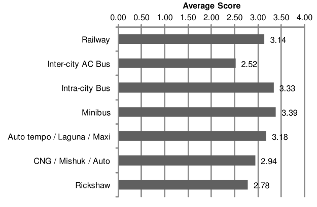
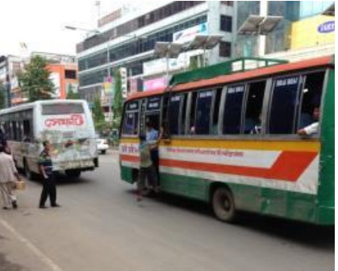
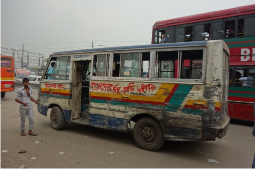
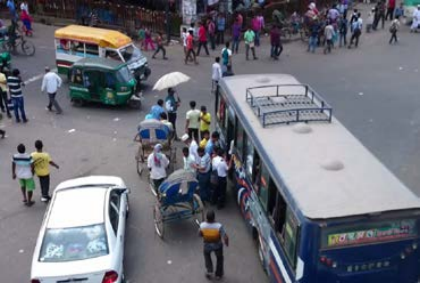

```{r setup, echo = FALSE }
library(knitr)
opts_chunk$set(echo=FALSE, comment=NA, warning=FALSE, message=FALSE)
source("../work_flow/RFILES/fig_serial_ref.R")
source("../work_flow/RFILES/tab_serial_ref.R")
```

# Introduction 

It was a sultry summer afternoon on 29th July of 2018. Two students of Shaheed Ramiz Uddin Cantonment School and College, Abdul Karim and Dia Khanom Mim, was waiting on the roadside of Airport road in Kurmitola area. Then according to eye witness, an Uttara-bound bus of 'Jabal-e-Noor Paribahan' lost control and ran over those two hapless students. They were dead on the spot.

This tragic event instigated a  unique movement  in the streets of Dhaka, Bangladesh. It brought about protests throughout the country and particularly in Dhaka, the school students took over the control of the streets replacing the traffic police. It created a great political upheaval in Bangladesh.  High school kids, secondary school kids came to streets protesting death of two of their friends.  This kids actually ruled the city for a few days, controlling traffics. This protests finally ended after a week or so amidst government crackdown which allegedly through human rights abuse. But it captured a big part of public imagination and is believed to remain in public memory for a long time.

It was a common incident that Bus drivers are quite reckless. That was not the first time it happened. Frequently these city buses were involved in several accidents. People were already pissed off. Therefore, when kids got involved it became very sensitive.

With this background, we would like to investigate whether mass transportation, particularly Bus service is problematic or not. It is apparent this sector is quite competitive. There are quite a few actors in the market. Bus drivers compete with each other to pick up passengers and finish the trip earlier.

It is usually expected that competition will bring about better service and quality in a market. In transportation sector in Bangladesh it seemed that competition brought about the worst possible outcome for transportation. This paper investigates the reasons behind this phenomenon. We found that this is actually a classic case of market failure since mass transportation is essentially a public good with externality effect. Therefore, market equilibrium resulted into socially inefficient outcome. A related  objective of this paper is to look into the economic incentive of Bus operators that lead to this stiff aggressively competitive behaviors which led to the tragic incident. We will look into the current employment structure which is actually determined by the whole mass transportation industry.


# Transporation infrastructre

## My version

First start with an small intro of dhaka. then talk about the population size, how fast it is growing. then talk about modal share and show the importance of bus.


## Background


### Dhaka city and its bus

Dhaka, the capital city of Bangladesh, currently the inhabitation is more than 14.8 million people. To meet the daily needs of this high population, at present, there are about 30 million trips produced per day in Dhaka. To cater these huge trips, bus is only major available public transport system. Present Bus system in Dhaka City is mostly fragmented, ill-disciplined and disorganized, even though buses carry 47% of total trip and 70% of motorized trip. This is because there are no alternative public transport options for the daily commuters. 
 
### Dhaka city's deteriorating transportation 

Dhaka City is the capital of the People’s Republic of Bangladesh. In 2011, the Dhaka Metropolitan Area (DMA) had a population of 9.3 million. Currently, urban transportation in the  DMA relies heavily on road transport and traffic in the city is characterized by a chaotic mixture of cars, buses, auto-rickshaws, rickshaws, motorcycles, etc. This condition has resulted to serious traffic gridlocks and problems in the DMA which in turn has added to the 
city’s growing social and economic problems, such as posing serious health hazards to its citizens due to air pollution. With Bangladesh’s continued development and the continued  increase of its population the number of privately owned automobiles is expected to rise in the coming years and these phenomena will worsen the traffic gridlock and pollution problem in  the city. 

## Population 


from @dtca_rstp_2015

### Population growth in Bangladesh

Bangladesh Bureau of Statistics has been carrying out Population and Housing Census since 1872. As shown in Figure 2.14, average annual population growth rate (population AAGR) increased from 0.5% in 1921 to 2.5% in 1974 except in between 1941 to 1951 due to World War II and starvation. It was assumed that more than 3 million people died due to starvation and malnutrition. However, after 1974, 
population AAGR started decreasing from 2.5% to 1.4% in 2011.  Population of GDA  consists 15.7% of Bangladesh population with a population 

### Population growth in Dhaka

AAGR of 3.2% against a large number of social growth where only covers 5% land area of Bangladesh as shown in Table 2.4. Among the districts of GDA, population of Dhaka covers more than half of GDA population. While Gazipur and Narayanganj’s population are lower than Dhaka, the population AAGRs are higher against convenient locations which give an easy commute to Dhaka and a relatively lower land value[@dtca_rstp_2015].


## Organisation of institutions


### Institutions

The institutions involved is mainly Dhaka Metropolitan Area which includes Dhaka City Corporation (DCC). But DCC was divided into two parts: Dhaka North City Corporation (DNCC) and Dhaka South City Corporation (DSCC).  In RAJUK area there are 4 city corporations, DNCC, DSCC, Narayanganj City Corporation (NCC) and Gazipur City Corporation (GCC), GCC and NCC are new city corporations in the study area.

from page 23 of @dtca_rstp_2015

```{r, fig.height=2.5}
include_graphics("./figures/dma.png")
```

from page  of @dtca_rstp_2015

```{r, fig.width=2.5}
include_graphics("./figures/gda.png")
```


### Project area

The Project Area covers the whole of Greater Dhaka Area (GDA) which consists of Dhaka, Gazipur, Manikganj, Munshiganj, Narayanganj, and Narshingdi districts. The total area of 7,500 km2 has 24.4 million or more residents since 2011. Of which, RAJUK area which was more developed has 14.8 million residents in 1,500 km 2 of its area. In contrast to the low population density of the entire GDA (31 person/ha), RAJUK area has very high density (111 person/ha). It can also be expected that the center of RAJUK area has much higher population density than that of the entire RAJUK. 

## No. of vehicles

### Bus and minibus situation

Currently, bus and minibus are the main mode of transport for dwellers of GDA. The number of bus routes is increasing every year to meet the travel demand of the people. However, the number of trips is still insufficient to meet the present demand. One of the reasons of low bus trips in GDA is inability to complete the planned daily trips due to traffic congestion.


### Definition of bus and minibus

According to Bangladesh law, ‘Mini-bus’ means any motor vehicle constructed or adapted or used to carry not more than 30 persons excluding the driver. If the number of passengers exceeds 30 persons excluding the driver then it is considered as bus. The number of registered buses is increasing than the mini-buses. In 2003, minibus has a bigger share compared with bus however the number has totally changed as the government encourages the introduction of large buses into the public transport system of Dhaka. In particular, importing of CNG driven buses has been encouraged in the national budget for the last few years. 


### No. of vehicles and routes

According to @anwar_palo_words_2018, BRTA data shows there are 3.30 million vehicles in the country. In the same vein, according to  BRTC, there are 35,000 buses and mini buses, half of which operate outside Dhaka.According to Bangladesh Road Transport Authority (BRTA), a total of 7,937 bus and mini buses ply along 246 routes in Dhaka and its adjacent areas.

Bus, CNG-run auto-rickshaw and rickshaw are three mainstays of public transport in the capital. Bus and auto-rickshaw contribute to as many as 87.40 per cent of road transport communication in Dhaka while bus alone makes 72 per cent.[^jica]

[^jica]: These information comes from two major studies done by Dhaka Transport Coordination Board (DTCB) at the behest of Japan International Cooperation Agency (JICA). The first was completed in 2010 [@dtcb_preparatory_2010] follwed up by [@dtcb_preparatory_2011]. Considering this situation the government of Bangladesh formulated a ‘Strategic Transportation Plan’ (STP) in cooperation with the World Bank in 2005. The implementing agency is Dhaka Transport Coordination Board (DTCB) under the Ministry of Communications (MOC). The STP prepared ‘Urban Transportation Policy’ for 20 years (2004–2024), and identified priority issues
such as improvement of mass transit system (buses and rail transportations) , development of urban expressway and establishment of organization in implementation and maintenance/operation of the projects.
Since the STP has already received the official approval of the government of Bangladesh, it is

### Owners and route permission

Many bus owners have one or two buses. Dhaka Metropolitan Regional Transport Committee gives permission for movement of the vehicles. The committee members include police and representatives from BRTA, different departments of the government and bus owners and workers. 
After the application for permission, traffic police, the opinions of bus owners-workers and the clout of the applicants are taken into consideration.The route permission was given after setting certain conditions of the Motor Vehicle Act, without any consideration of passengers’ route demands, population density or road capacity. Due to unplanned and unnecessary routes and innumerable owners, the buses enter unhealthy competition. As there are many owners under the same company, the drivers of buses join in a competition as to who will pick up passengers first and this causes road accidents.

### Table  on buses and minibuses

Table 2-3: Number of Registered Buses and Minibuses in Dhaka (Yearly) 
Year 
Up to 
2000 
2001 
2002 
2003 
2004 
2005 
2006 
2007 
2008 
2009 
2010 
2011 
2012 
2013 
2014 
2015 
 
2016 
Grand 
Total 
Bus 
1,155 
453 
632 
374 
779 
728 
949 
1,082 1,144 
914 
1231 
1501 
1218 
971 
1364 
2221 
3419 
27537 
Mini-
bus 
3,654 
831 
1,924 
1,051 
368 
118 
75 
77 
107 
112 
149 
136 
103 
83 
135 
103 
164 
10214 
Total 
4809 
1284 
2556 
1425 
1147 
846 
1024 
1159 
1251 
1026 
1380 
1637 
1321 


## Bus routes

### Historic overview of bus routes

In Dhaka city in 1992, there were only 27 bus routes in which 8 was bus route and 19 was minibus route. At that time only 304 Buses and 1194 Minibuses were in operation (DITS, 1994) [2]. From 1994, Route Permit Section of BRTA provided permits for bus and minibus routes in Dhaka. The owners of the buses and minibuses usually did not report the scraping of their vehicles, for which BRTA could not take into account the number of vehicles/buses which were decommissioned from time to time. Thus, the registration records did not represent the actual number of motor vehicles which were operating on the roads of Dhaka. Moreover, BRTC buses, private buses, departmental buses/staff buses of Dhaka are not included in the route lists.

Overlapping bus routes from page 150 of @dtca_rstp_2015

```{r}
include_graphics("./figures/bm_overlapping_routes.png")
```

### No of bus operators, no of buses, routes, drivers incentive

About 255 bus operators ply in the streets of Dhaka with around 8000 buses. There are around 129 routes on which this buses runs through. There are no planned structure on which bus operator will maintain which route, there are no time schedule. Unbriddled competition has led to total chaos in this sector. This immensely affected the behaviour of drivers who are at the heart of maintaining safety on the road. The channel through which this drivers are affected is mainly their main source of livelihood, the salary earned from driving these buses. It is how their earning is determined will affect current state. Therefore the main focus of our discussion is the remuneration packages that is offered to these drivers. 


## Importance of Bus in urban transport

### Modal share

from @dtca_rstp_2015

```{r, fig.width=2.5}
include_graphics("./figures/rstp_modal_share_traffic.png")
```

from @dtca_rstp_2015

```{r, fig.width=2.5}
include_graphics("./figures/rstp_modal_share_passenger.png")
```

# Consequence of competition 

## Profitability of bus 

@rahman_business_2017 reveals that present bus business model negatively affects the bus operations. It has unearthed that against benchmark costs for proper bus operations, present operators operating their buses with average 30% losses. They are surviving because most of the operators are paying low wages to the labors (driver, conductors, helpers), and poorly maintain the buses. They are reducing the quality of the bus service to minimize their cost. 
Some of the operators who have taken loan form bank are not able to paying to the bank in due time and some of the operators have very old fleet which they already recover their capital investment and some do not survive at all and are bound to leave the business. As a 
result, very little new investment is happening in city bus service from private sector and number of bus is not increasing as desired rather bus owners or operators are not reinvesting 
their money in city transport service. 

## Aggresively competitive nature of bus drivers

Due to overlapping routes, the driver compete each other to get more passengers, create obstruction near to junction so that bus cannot overtake, driver does not care about safety of the passenger during boarding and alighting. 

## Increase in no. of cars

Thus, due to absence of adequate, reliable and quality public transport, numbers of private cars are increasing day by day and congestion is increasing due to inadequate road space as well as 
poor traffic management. The main problem lies with business model. Present business plan, operators carry all kinds of risks on the other hand government is not taking any risk of bus 
operation in Dhaka. 

## Condition of bus

### Evaluation of passengers

from page 124 of @dtca_rstp_2015

```{r}

```

### Actual bus condition 


from page 146 of @dtca_rstp_2015

```{r}

```

from page 146 of @dtca_rstp_2015

```{r}

```
```{r}

```


## Overall standard of transportation

### Poor state

The competitive nature of the mass transportation in Metropolitan Dhaka lowered the standard compared to other cities in the world . Following is the direct quote from @dtca_utp_2015: 
"The transport systems in Metropolitan Dhaka are not only below standard compared to many other capital cities, but they have reached the crisis point that requires an immediate attention. A joint effort is needed from all concerned to resolve the transport problem of the city." This report identifies several consequences related to this poor state of mass transportation. 

### Deaths, injury due to accidents

Firstly, there is high frequency of deaths, injury and property damages. It results into serious loss of productivity and imparts a great burden on the economy and social cost in terms of family trauma and in social relationship. Due to these damages, it has been estimated that each year US\$700  is lost which is 3% of the GDP. There are many reasons for this loss but directly results from competition is poor driving capabilities, defective vehicles. As argued above, competition resulted in lower price which was achieved by lower quality. These road accident, casualties and collisions are direct result of number and quality of vehicles on the road. 

#### Number of accidents

2000 
2001 
2002 
2003 
2004 
2005
2006
2007
2008
2009
2010 
2011 
2012
2013
852 
519 
876 
828 
668 
496
603
565
642
525
458 
400 
372
341
Source: Accident


# Why competition does not work

# Concluding remarks


# References

